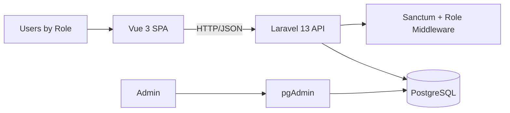

# Project Documentation

## 1. Overview

This project is a full-stack healthcare management platform designed for multi-role hospital workflows.
It enables coordinated care between global administrators, hospital administrators, nurses, doctors, and patients.

The application provides role-based dashboards and API access for:
- Hospital administration
- Medical staff management
- Patient follow-up and history
- Consultations and general assessments
- Treatment, advice, appointments, and questionnaire responses

## 2. Core Features

### Authentication and Access Control
- Token-based authentication with Laravel Sanctum
- Login/logout API
- Role-based route protection using custom middleware (`role` alias)
- Frontend redirection to role-specific dashboards after login

### Hospital and Organization Management
- Manage hospitals (create/update/delete/list)
- Create and assign hospital administrators
- Hospital-scoped administration workflows

### Clinical Master Data
- Toxicity management
- Symptom management
- Medical staff management:
  - Nurses (CRUD)
  - Doctors (CRUD)

### Care Delivery and Follow-up
- Patient management by nursing staff
- Doctor-managed consultations (CRUD)
- General health status/bilan management
- Medical questionnaires and responses
- Appointment scheduling (rendez-vous)
- Treatment and advice publication

### Patient Self-Service
- View assigned questions and medical history
- Submit, edit, and delete questionnaire responses
- Access personal:
  - Appointments
  - Treatments
  - Advice
  - Bilans
  - Consultations

## 3. Roles and Responsibilities

| Role | Main Capabilities |
|---|---|
| `ADMINGLOBAL` | Manage hospitals and create/assign hospital admins |
| `ADMINHOPITAL` | Manage toxicities, symptoms, nurses, and doctors |
| `INFIRMIERE` | Manage patients and view doctors |
| `MEDECIN` | Manage consultations, bilans, questions, appointments, treatments, advice, and view responses |
| `PATIENT` | Submit and manage responses, view personal medical follow-up data |

## 4. System Architecture



### Architectural Style
- Frontend: Single Page Application (Vue)
- Backend: REST API (Laravel)
- Data layer: Relational database (PostgreSQL)
- Deployment model: Containerized local stack via Docker Compose

## 5. Technology Stack

### Backend
- PHP `^8.3`
- Laravel `^13`
- Laravel Sanctum `^4`
- PHPUnit `^12` (testing)

### Frontend
- Vue `^3`
- Vue Router `^5`
- Pinia `^3`
- Axios
- Vite `^7`

### Infrastructure
- Docker + Docker Compose
- PostgreSQL `16`
- pgAdmin 4
- Apache (inside backend container)

## 6. Project Structure

```text
.
├── backend/
│   ├── src/
│   │   ├── app/
│   │   │   ├── Http/Controllers/
│   │   │   ├── Http/Middleware/
│   │   │   └── Models/
│   │   ├── routes/
│   │   │   ├── api.php
│   │   │   └── web.php
│   │   ├── database/
│   │   └── tests/
│   ├── Dockerfile
│   └── apache.conf
├── frontend/
│   ├── app/
│   │   ├── src/
│   │   │   ├── views/
│   │   │   ├── router/
│   │   │   └── stores/
│   │   └── package.json
│   └── Dockerfile
└── docker-compose.yml
```

## 7. API and Frontend Routing Summary

### API Base URL
- `http://localhost:8080/api`

### Frontend URL
- `http://localhost:8081`

### Database Admin UI
- `http://localhost:5050`

### Main Route Groups (API)
- Public: `/login`
- Authenticated: `/logout`
- Role-scoped groups:
  - `/hopitaux`, `/admins-hopital` (global admin)
  - `/hopital/*`, `/infermiers`, `/medecins` (hospital admin)
  - `/infirmiers/*` (nurse)
  - `/medecin/*` (doctor)
  - `/patient/*` (patient)

## 8. Getting Started

### Prerequisites
- Docker
- Docker Compose

### Run with Docker

1. Start all services:

```bash
docker-compose up -d
```

2. Access services:
- Frontend: `http://localhost:8081`
- Backend API: `http://localhost:8080/api`
- pgAdmin: `http://localhost:5050`

3. If needed, run migrations inside backend container:

```bash
docker exec -it PHP_backend php artisan migrate
```

## 9. Development and Quality Commands

### Backend (inside `backend/src`)

```bash
composer install
php artisan key:generate
php artisan test
```

### Frontend (inside `frontend/app`)

```bash
npm install
npm run dev
npm run build
npm run lint
```

## 10. Typical Usage Flow

1. User logs in from the frontend login page.
2. Backend validates credentials and returns a token + role.
3. Frontend stores the token and redirects to a role-specific dashboard.
4. Each dashboard interacts with role-protected API endpoints.
5. Clinical and administrative data is persisted in PostgreSQL.

## 11. Security Notes

- API access is protected by Sanctum tokens.
- Role checks are enforced server-side through middleware.
- Sensitive actions are scoped by role-specific route groups.

## 12. Future Improvements

- Add endpoint-level OpenAPI/Swagger documentation
- Add CI pipeline for linting and automated tests
- Add refresh-token/session-expiration UX handling
- Improve environment parity between Docker and `.env.example`
- Expand automated test coverage for role-based scenarios

## 13. Endpoints API (Detailed)

Base URL: `http://localhost:8080/api`

### Public

| Method | Endpoint | Auth | Role | Controller@Action |
|---|---|---|---|---|
| POST | `/login` | No | Public | `AuthController@login` |

### Authenticated

| Method | Endpoint | Auth | Role | Controller@Action |
|---|---|---|---|---|
| POST | `/logout` | Yes | Any authenticated | `AuthController@logout` |

### ADMINGLOBAL

| Method | Endpoint | Controller@Action |
|---|---|---|
| GET | `/hopitaux` | `HopitalController@index` |
| POST | `/hopitaux` | `HopitalController@store` |
| PUT | `/hopitaux/{id}` | `HopitalController@update` |
| DELETE | `/hopitaux/{id}` | `HopitalController@destroy` |
| POST | `/admins-hopital` | `AdminController@createAdminHopital` |

### ADMINHOPITAL

| Method | Endpoint | Controller@Action |
|---|---|---|
| GET | `/hopital/toxicites` | `ToxiciteController@index` |
| POST | `/hopital/toxicites` | `ToxiciteController@store` |
| PUT | `/hopital/toxicites/{id}` | `ToxiciteController@update` |
| DELETE | `/hopital/toxicites/{id}` | `ToxiciteController@destroy` |
| POST | `/symptomes` | `SymptomeController@store` |
| GET | `/symptomes/{id}` | `SymptomeController@show` |
| PUT | `/symptomes/{id}` | `SymptomeController@update` |
| DELETE | `/symptomes/{id}` | `SymptomeController@destroy` |
| GET | `/infermiers` | `InfermierController@index` |
| POST | `/infermiers` | `InfermierController@store` |
| GET | `/infermiers/{infermier}` | `InfermierController@show` *(apiResource, non implementee dans le controller actuel)* |
| PUT/PATCH | `/infermiers/{infermier}` | `InfermierController@update` |
| DELETE | `/infermiers/{infermier}` | `InfermierController@destroy` |
| GET | `/medecins` | `MedecinController@index` |
| POST | `/medecins` | `MedecinController@store` |
| GET | `/medecins/{medecin}` | `MedecinController@show` *(apiResource, non implementee dans le controller actuel)* |
| PUT/PATCH | `/medecins/{medecin}` | `MedecinController@update` |
| DELETE | `/medecins/{medecin}` | `MedecinController@destroy` |

### INFIRMIERE

| Method | Endpoint | Controller@Action |
|---|---|---|
| GET | `/infirmiers/patients` | `PatientController@index` |
| POST | `/infirmiers/patients` | `PatientController@store` |
| GET | `/infirmiers/patients/{id}` | `PatientController@show` |
| PUT | `/infirmiers/patients/{id}` | `PatientController@update` |
| DELETE | `/infirmiers/patients/{id}` | `PatientController@destroy` |
| GET | `/infirmiers/medecins` | `MedecinController@index` |

### MEDECIN

| Method | Endpoint | Controller@Action |
|---|---|---|
| GET | `/medecin/my-patients` | `PatientController@getMedecinPatients` |
| GET | `/medecin/toxicites` | `ToxiciteController@index` |
| GET | `/medecin/symptomes` | `SymptomeController@index` |
| GET | `/medecin/consultations` | `ConsultationController@index` |
| POST | `/medecin/consultations` | `ConsultationController@store` |
| GET | `/medecin/consultations/{id}` | `ConsultationController@show` *(route exposee; methode non presente dans le controller actuel)* |
| PUT | `/medecin/consultations/{id}` | `ConsultationController@update` |
| DELETE | `/medecin/consultations/{id}` | `ConsultationController@destroy` |
| POST | `/medecin/etat-general` | `EtatGeneralController@store` |
| GET | `/medecin/etat-general/consultation/{consultation_id}` | `EtatGeneralController@showByConsultation` |
| PUT | `/medecin/etat-general/{id}` | `EtatGeneralController@update` |
| DELETE | `/medecin/etat-general/{id}` | `EtatGeneralController@destroy` |
| GET | `/medecin/questions` | `QuestionController@index` |
| POST | `/medecin/questions` | `QuestionController@store` |
| PUT | `/medecin/questions/{id}` | `QuestionController@update` |
| DELETE | `/medecin/questions/{id}` | `QuestionController@destroy` |
| GET | `/medecin/rendez-vous` | `RendezVousController@index` |
| POST | `/medecin/rendez-vous` | `RendezVousController@store` |
| PUT | `/medecin/rendez-vous/{id}` | `RendezVousController@update` |
| DELETE | `/medecin/rendez-vous/{id}` | `RendezVousController@destroy` |
| GET | `/medecin/traitements` | `TraitementController@index` |
| POST | `/medecin/traitements` | `TraitementController@store` |
| PUT | `/medecin/traitements/{id}` | `TraitementController@update` |
| DELETE | `/medecin/traitements/{id}` | `TraitementController@destroy` |
| GET | `/medecin/conseils` | `ConseilController@index` |
| POST | `/medecin/conseils` | `ConseilController@store` |
| PUT | `/medecin/conseils/{id}` | `ConseilController@update` |
| DELETE | `/medecin/conseils/{id}` | `ConseilController@destroy` |
| GET | `/medecin/responses` | `ReponseController@getRponses` |

### PATIENT

| Method | Endpoint | Controller@Action |
|---|---|---|
| GET | `/patient/my-questions` | `QuestionController@afficherQuestionsPatient` and `ReponseController@getMyQuestions` *(route duplicate dans api.php: la derniere declaration peut ecraser la premiere selon l'ordre de chargement)* |
| POST | `/patient/submit-responses` | `ReponseController@storeReponses` |
| GET | `/patient/my-history` | `ReponseController@getPatientHistory` |
| PUT | `/patient/responses/{id}` | `ReponseController@updateReponses` |
| DELETE | `/patient/responses/{id}` | `ReponseController@destroyReponse` |
| GET | `/patient/my-rendez-vous` | `RendezVousController@getPatientRDV` |
| GET | `/patient/my-traitements` | `TraitementController@getPatientTraitements` |
| GET | `/patient/my-conseils` | `ConseilController@getPatientConseils` |
| GET | `/patient/my-bilans` | `EtatGeneralController@getPatientBilans` |
| GET | `/patient/my-consultations` | `ConsultationController@getPatientConsultations` |

## 14. Validation Requests

Le projet n'utilise pas (pour l'instant) de classes `FormRequest` dans `app/Http/Requests`.
Les validations sont faites inline via `$request->validate(...)` ou `Validator::make(...)` dans les controllers.

### Principales regles de validation par domaine

| Domaine | Endpoints principaux | Champs valides |
|---|---|---|
| Auth | `POST /login` | `email: required|string|email`, `mot_de_passe: required|string` |
| Hopital | `POST/PUT /hopitaux` | `nom`, `adresse`, `telephone (unique)`, `email (unique)` |
| AdminHopital | `POST /admins-hopital` | `nom`, `prenom`, `email unique`, `mot_de_passe min:8`, `hopital_id exists+unique` |
| Toxicite | `POST/PUT /hopital/toxicites` | `nom`, `description nullable` |
| Symptome | `POST/PUT /symptomes` | `nom`, `description nullable`, `toxicite_id exists` |
| Infermier | `POST/PUT /infermiers` | `nom`, `prenom`, `email unique`, `mot_de_passe min:8` |
| Medecin | `POST/PUT /medecins` | `nom`, `prenom`, `email unique`, `password min:8`, `specialite` |
| Patient | `POST/PUT /infirmiers/patients` | `nom`, `prenom`, `email unique`, `password min:8`, `date_naissance date`, `sexe`, `telephone`, `medecin_id exists` |
| Consultation | `POST/PUT /medecin/consultations` | `date`, `gravite`, `patient_id exists`, `toxicite_ids array`, `symptome_ids array` |
| EtatGeneral | `POST/PUT /medecin/etat-general` | `description required`, `consultation_id exists` ou `reponse_id exists` |
| Question | `POST/PUT /medecin/questions` | `titre required|string|max:255` |
| RendezVous | `POST /medecin/rendez-vous` | `date required|after:now`, `etat_general_id exists`, `patient_id exists` |
| Traitement | `POST /medecin/traitements` | `nom required`, `description required`, `etat_general_id exists` |
| Conseil | `POST /medecin/conseils` | `description required`, `etat_general_id exists` |
| Reponse patient | `POST/PUT /patient/submit-responses`, `/patient/responses/{id}` | `responses array`, `responses.*.question_id exists`, `responses.*.reponse string` |

## 15. Modeles (Backend)

Modeles detectes dans `backend/src/app/Models`:

- `User`: identite + role (ADMINGLOBAL, ADMINHOPITAL, INFIRMIERE, MEDECIN, PATIENT)
- `Hopital`: entite hopital
- `AdminHopital`: liaison user admin hopital <-> hopital
- `Infermier`: profil infirmiere lie a user + hopital
- `Medecin`: profil medecin lie a user + hopital
- `Patient`: profil patient lie a user + hopital + medecin
- `Toxicite`: toxicite clinique (scope hopital)
- `Symptome`: symptome lie a une toxicite
- `Consultation`: consultation medecin/patient + relations toxicites/symptomes
- `EtatGeneral`: bilan lie a une consultation ou a une session de reponse
- `Question`: questions du questionnaire medecin
- `Reponse`: session de reponses patient
- `reponse_questionnaires`: details question/reponse par session
- `RendezVous`: rendez-vous patient, souvent derive d'un etat general
- `Traitement`: traitement patient, derive d'un etat general
- `Conseil`: conseil patient, derive d'un etat general
- `Notification`: notifications (modele present, peu exploite dans routes actuelles)

## 16. Reponses API (Formats)

Les reponses JSON ne suivent pas un unique contrat global, mais on retrouve ces patterns:

### Success patterns

- Liste ou objet direct:

```json
[
  { "id": 1, "...": "..." }
]
```

- Reponse avec message + data:

```json
{
  "message": "Operation reussie",
  "data": { "id": 1 }
}
```

- Auth login:

```json
{
  "user": { "id": 1, "role": "ADMINHOPITAL" },
  "token": "<sanctum_token>",
  "role": "ADMINHOPITAL",
  "hopital_id": 2
}
```

### Error patterns

- Validation (Laravel):

```json
{
  "field_name": ["validation error message"]
}
```

- Business/Auth error:

```json
{
  "message": "Description de l'erreur"
}
```

### HTTP status frequents

- `200`: lecture/update/suppression OK
- `201`: creation OK
- `400`: payload invalide/metier (ex: etat general non coherent)
- `401`: authentification invalide
- `403`: acces/refus role ou scope
- `404`: ressource/profil introuvable
- `422`: erreurs de validation
- `500`: erreur interne (cas ponctuels)
